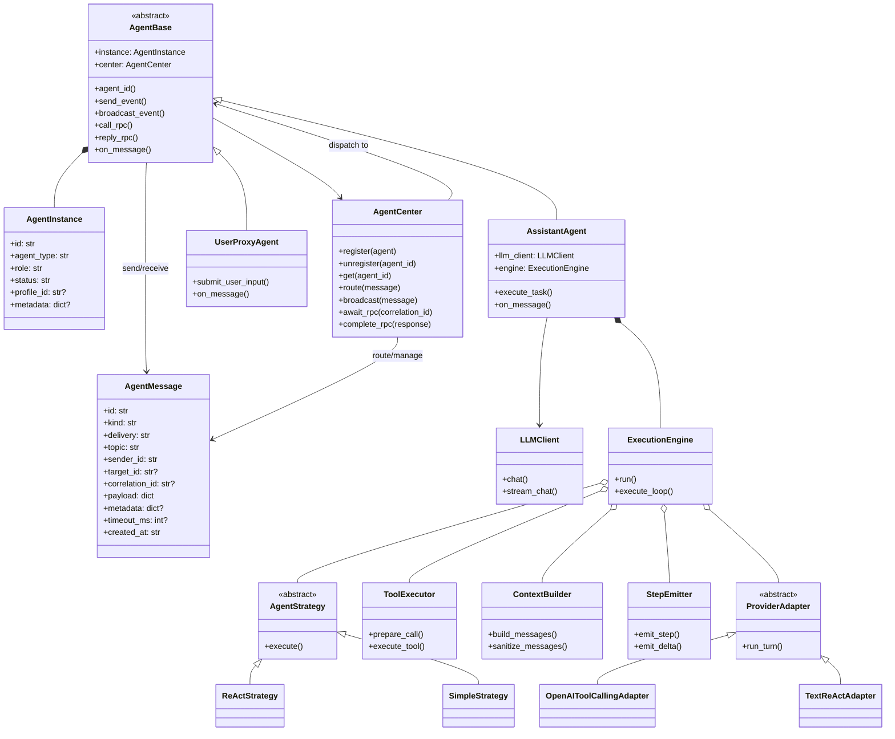
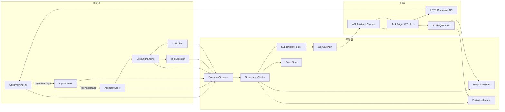

# Agent 消息中心设计草案

- 状态：草案
- 日期：2026-03-09
- 范围：重点讨论后端 Agent 之间的消息系统，并补充面向前端的执行观测输出与通信通道设计，不展开具体 UI 细节
- 目标：统一 Agent 概念，删除 `subagent`，建立可扩展的 Agent 协作基础设施

## 1. 结论先行

根据当前仓库现状和我们这轮讨论，后端现在最大的结构性问题不是“缺少更多能力”，而是 **Agent 相关概念混在了一起**。

当前系统里混在一起的概念主要有：

- 执行策略：`AgentStrategy`
- 执行外壳：`AgentExecutor`
- 会话驱动运行：`chat_agent_runtime`
- 静态能力配置：`agent_profile`
- 旧委派模型：`subagent`

这些概念分别回答不同问题，但当前代码里还没有被正式分层，所以后续一旦要做多 Agent 协作，就会持续混乱。

这份设计文档的核心结论是：

> 后端应该正式建立 `AgentBase / AssistantAgent / UserProxyAgent / AgentInstance / AgentCenter / AgentMessage / LLMClient` 这套模型，并把现有 `AgentStrategy + AgentExecutor` 重构为 AssistantAgent 内部的执行内核，逐步收敛成 `ExecutionEngine`；同时直接删除 `subagent`。

## 2. 当前仓库的真实现状

## 2.1 当前并没有“正式的 Agent 类型体系”

从后端代码看，当前其实并没有一个清晰的一等 Agent 类型体系。

现有的只有三种接近 Agent 的概念：

### A. 执行策略类型

执行策略定义在：

- `python-backend/agents/base.py`：`AgentStrategy`
- `python-backend/agents/executor.py`：`create_agent_executor`

当前工厂只支持两种策略类型：

- `simple`
- `react`

也就是说，这里的 `agent_type` 更接近：

- “一次执行时选哪种推理/执行模式”

而不是：

- “系统里有哪些正式的 Agent 角色或类型”

### B. profile 配置

当前配置里只有 `default` 和 `subagent` 两个 profile，定义在：

- `python-backend/app_config.py`

这类 profile 本质上是：

- 静态能力模板
- Prompt / tool / policy 组合

它们不是运行时 Agent 类型。

### C. session 上的 Agent 标记

当前 `ChatSession` 上有：

- `agent_profile`
- `parent_session_id`

但并没有一个清晰的、与运行时 Agent 实体对齐的 Agent 模型。数据库虽然迁移里尝试加过 `agent_type`，但模型层和运行时层并没有把它真正立成一等概念。

所以更准确地说：

> 当前系统拥有的是“执行策略 + profile 配置 + session 挂载”，但还没有“正式的 Agent 类型 + Agent 实例 + Agent 通信层”。

## 2.2 当前 `AgentStrategy` 和 `AgentExecutor` 承载了太多“像 Agent 的东西”

这也是为什么容易产生误判：看起来后端好像已经有 Agent 了。

### `AgentStrategy` 当前承载的是

- 推理方式
- prompt 组织方式
- tool 使用策略
- 执行循环逻辑

也就是“脑子”的部分。

### `AgentExecutor` 当前承载的是

- strategy 调度
- tool 注入
- tool context 写入
- 错误包装
- step 流输出

也就是“执行外壳”的部分。

两者加在一起，已经非常接近一个“可执行体”。

但它们仍然缺这些关键能力：

- 注册到系统
- 作为长期存在的协作节点存在
- 接收消息
- 发送消息
- 发起 RPC
- 回复 RPC
- 发布 Event
- 被 AgentCenter 路由和管理

所以我更倾向于这样定性：

> `AgentStrategy + AgentExecutor` 不是完整的协作型 Agent，而是一个“执行内核”。

## 2.3 当前 `subagent` 应该直接删除，不应继续兼容

这次继续追代码之后，可以更明确地确认：`subagent` 不是消息系统，而是一个旧的、硬编码的委派工作流。

它的问题不是简单“写得不灵活”，而是建模方向就不适合继续保留。

### 旧模型做了什么

- 通过 `spawn_subagent` 工具发起委派
- 创建 child session
- 用 child session 再跑一套 Agent
- 把结果写回 parent session

### 旧模型的问题

- 把协作关系绑到 session tree
- 把协作入口绑到 tool call
- 把结果返回绑到“回写一条消息”
- 无法自然支持广播
- 无法自然支持持续事件订阅
- 无法自然支持标准化 RPC 生命周期

### 更关键的是：侵入面已经很深

`subagent` 不只是一个工具，它已经侵入了：

- 配置层
- 数据模型层
- 数据库层
- session rollback 逻辑
- tool 注册层

所以这里不建议“保留兼容层”，而是建议：

> 直接删除 `subagent`，不要在新架构里同时维护两套协作模型。

## 3. 新的概念分层

为了把后端概念理清，建议正式拆成下面几层。

## 3.1 `AgentMessage`

这是统一消息信封。

所有 Agent 之间的通信，不管是 RPC 还是 Event，都应该经过统一消息结构，而不是散落成多个特殊 payload。

建议字段：

- `id`
- `kind`：`rpc_request` / `rpc_response` / `event`
- `delivery`：`unicast` / `broadcast`
- `topic`
- `sender_id`
- `target_id`
- `correlation_id`
- `payload`
- `metadata`
- `timeout_ms`
- `created_at`

它回答的问题是：

- “Agent 之间交换的标准单位是什么？”

## 3.2 `AgentBase`

这是所有 Agent 的共同基类。

它回答的问题是：

- “一个 Agent 作为协作节点，最基本需要具备哪些能力？”

建议职责：

- 拥有身份
- 注册到 `AgentCenter`
- 接受消息
- 发送消息
- 发起 RPC
- 回复 RPC
- 发布 Event
- 维护基础状态
- 提供统一错误处理入口

建议接口：

```python
class AgentBase(ABC):
    def __init__(self, instance: "AgentInstance", center: "AgentCenter"):
        self.instance = instance
        self.center = center

    @property
    def agent_id(self) -> str:
        return self.instance.id

    async def send_event(self, topic: str, payload: dict, target_agent_id: str | None = None):
        ...

    async def broadcast_event(self, topic: str, payload: dict, scope: str):
        ...

    async def call_rpc(self, topic: str, payload: dict, target_agent_id: str, timeout_ms: int = 300000):
        ...

    async def reply_rpc(self, request: "AgentMessage", payload: dict, ok: bool = True):
        ...

    @abstractmethod
    async def on_message(self, message: "AgentMessage"):
        ...
```

## 3.3 `AssistantAgent(AgentBase)`

这是具体执行任务的 Agent。

它回答的问题是：

- “谁来真正处理任务、调用 LLM、使用工具、产出结果？”

建议职责：

- 接收任务类 RPC
- 组织执行上下文
- 调用 `LLMClient`
- 驱动执行内核
- 返回结果或发布事件

这里有一个关键决定：

> 现有的 `AgentStrategy + AgentExecutor`，建议不要继续对外暴露成“Agent 抽象”，而是作为 `AssistantAgent` 的内部执行内核存在。

也就是说：

- `AssistantAgent` 是外部看到的 Agent
- `Strategy + Executor` 是内部怎么完成任务的实现细节

## 3.4 `UserProxyAgent(AgentBase)`

这是用户代理 Agent。

它回答的问题是：

- “用户输入如何进入 Agent 世界？”

它不是为了替代真实用户，而是为了把用户输入纳入统一的 Agent 消息协议。

建议职责：

- 接收用户输入
- 组装标准 `AgentMessage`
- 发送给目标 Agent
- 等待结果并返回给用户侧调用方

它不应该负责：

- 复杂推理
- 实际任务执行
- 充当业务工作 Agent

## 3.5 `AgentInstance`

这个概念要特别说明清楚。

### 结论

`AgentInstance` 可以保留，但应该先把它当成：

- **实例元数据结构**

而不是：

- **另一个有行为的 Agent 对象**

否则会立刻产生重复建模：

- `AssistantAgent` 是 Agent
- `AgentInstance` 也像 Agent
- 最后不清楚谁才是运行时主体

### 建议定位

建议这样分工：

- `AgentBase` / `AssistantAgent` / `UserProxyAgent`：行为对象
- `AgentInstance`：身份与状态数据

建议字段：

- `id`
- `agent_type`
- `role`
- `status`
- `profile_id`
- `metadata`
- `created_at`
- `updated_at`

示例：

```python
@dataclass
class AgentInstance:
    id: str
    agent_type: str
    role: str
    status: str = "idle"
    profile_id: str | None = None
    metadata: dict[str, Any] | None = None
```

### 多个 AssistantAgent 怎么存在

如果系统里有多个 AssistantAgent，不是说只有一个类实例，而是：

- 创建多个 `AssistantAgent` 对象
- 每个对象持有不同的 `AgentInstance`

例如：

- `planner-1`
- `coder-1`
- `reviewer-1`

都可以是 `AssistantAgent` 类的实例，只是内部持有不同的 `AgentInstance` 数据。

这点非常重要：

> `AssistantAgent` 是类；`AssistantAgent(...)` 创建出来的对象才是运行中的具体 Agent；`AgentInstance` 是这个对象持有的实例数据。

## 3.6 `AgentCenter`

这是中心中转层。

它回答的问题是：

- “Agent 之间的消息由谁来路由、注册、管理、超时控制？”

第一版建议合并两种职责在一起：

- 注册中心
- 消息中心

也就是说，`AgentCenter` 第一版可以同时负责：

- register / unregister
- agent lookup
- unicast routing
- broadcast expansion
- RPC correlation
- timeout handling

后面如果系统复杂度变高，再拆成：

- `AgentRegistry`
- `MessageCenter`

但第一版没必要提前拆太细。

## 3.7 `LLMClient`

这个概念很清楚，应该保留为独立能力组件。

它回答的问题是：

- “谁负责和 LLM API 直接交互？”

建议边界：

- 只处理模型调用
- 不处理 Agent 注册
- 不处理消息路由
- 不处理 RPC/Event 语义

一句话：

> `LLMClient` 是工具，不是 Agent。

## 4. 推荐的对象关系

## 4.1 推荐结构

后端推荐采用下面这组核心对象：

- `AgentMessage`
- `AgentBase`
- `AssistantAgent(AgentBase)`
- `UserProxyAgent(AgentBase)`
- `AgentInstance`
- `AgentCenter`
- `LLMClient`

## 4.2 关系说明

### 行为与数据分离

- `AgentBase` 持有 `AgentInstance`
- `AgentInstance` 只保存身份与状态
- `AgentCenter` 管理 `AgentBase` 实例

### 执行与协作分离

- `AssistantAgent` 负责协作入口与任务处理
- `AgentStrategy + AgentExecutor` 负责内部执行
- `LLMClient` 只负责模型调用

### 用户入口统一

- 用户输入先进入 `UserProxyAgent`
- 再转换为标准 `AgentMessage`
- 再由 `AgentCenter` 路由到目标 Agent

## 4.3 一个典型实例关系

```python
planner = AssistantAgent(
    instance=AgentInstance(
        id="planner-1",
        agent_type="assistant",
        role="planner",
        profile_id="default",
    ),
    center=center,
    llm_client=llm_client,
)

coder = AssistantAgent(
    instance=AgentInstance(
        id="coder-1",
        agent_type="assistant",
        role="coder",
        profile_id="default",
    ),
    center=center,
    llm_client=llm_client,
)

user = UserProxyAgent(
    instance=AgentInstance(
        id="user-1",
        agent_type="user_proxy",
        role="user",
    ),
    center=center,
)
```

这里：

- `planner`、`coder`、`user` 都是运行时对象
- `planner-1`、`coder-1`、`user-1` 是实例身份
- `AgentCenter` 按 `id` 路由消息

## 4.4 类图



这张类图表达的重点是：

- 对外的正式 Agent 只有 `AgentBase` 及其子类
- `AgentInstance` 只是实例数据，不是另一个行为对象
- `AssistantAgent` 内部持有执行内核，而不是直接把 `Strategy` 暴露成 Agent
- 当前过胖的 `AgentStrategy + AgentExecutor` 应当被收敛成更清晰的 `ExecutionEngine`

## 4.5 `ExecutionEngine` 重构建议

当前 `react.py` 很重，职责也明显超出了“策略”的边界。它已经不只是一个简洁的执行策略，更像是一个混合了：

- 策略
- provider 适配
- 执行循环
- tool 调用
- shell 特殊流控
- step 发射
- 上下文清洗

的执行系统。

所以建议把当前“胖 Strategy、瘦 Executor”的结构，逐步重构成：

- 轻 `Strategy`
- 真正有意义的 `ExecutionEngine`

### 4.5.1 重构原则

#### `AgentStrategy` 负责什么

`AgentStrategy` 只保留真正属于“策略”的东西：

- 下一步怎么思考
- 下一步是否调用工具
- 下一步是否结束回答
- 如何从模型输出中提取 action / answer

#### `ExecutionEngine` 负责什么

`ExecutionEngine` 负责一次执行生命周期：

- 上下文准备
- provider 分流
- 执行循环
- tool 调度
- shell / PTY 特例执行
- step / delta 发射
- stop / interrupt / timeout 管理

### 4.5.2 建议拆分的内部组件

如果按当前 `react.py` 的职责拆，建议至少分出下面几块：

- `ProviderAdapter`
  - OpenAI tool-calling 路径
  - text-react 路径
- `ToolExecutor`
  - 工具查找
  - 参数解析
  - 工具执行
  - 错误包装
- `ContextBuilder`
  - message 构造
  - prompt sanitize
  - 截断与压缩
- `StepEmitter`
  - 统一输出 `AgentStep`
  - 统一处理 delta / final
- `ShellStreamRunner`（可选）
  - 处理 `run_shell` 这类重型流式工具

### 4.5.3 推荐演进方向

不建议一开始推翻全部执行代码，而是建议这样演进：

1. 保留现有 `AgentStrategy` / `AgentExecutor`
2. 先把 `AgentExecutor` 扩成真正的执行引擎
3. 把 `react.py` 里的 orchestration 逻辑一点点往 `ExecutionEngine` 迁移
4. 最终把 `ReActAgent` 更名为 `ReActStrategy`
5. 让 `AssistantAgent` 持有 `ExecutionEngine`

也就是说，最终方向不是：

- 再做一个更胖的 Strategy

而是：

- 让 Strategy 回归策略
- 让 Engine 承担执行系统职责

## 4.6 文件落点建议

为了避免概念再次混杂，建议把“协作层”和“执行内核层”分目录。

### 推荐目录结构

```text
python-backend/
  agents/
    base.py                      # AgentBase
    assistant.py                 # AssistantAgent
    user_proxy.py                # UserProxyAgent
    instance.py                  # AgentInstance
    center.py                    # AgentCenter
    message.py                   # AgentMessage + enums
    execution/
      base.py                    # AgentStep / AgentStrategy
      engine.py                  # ExecutionEngine
      executor.py                # 兼容过渡层，逐步并入 engine
      simple_strategy.py         # 由 simple.py 迁移
      react_strategy.py          # 由 react.py 迁移
      prompt_builder.py          # 现 prompt_builder.py
      tool_executor.py           # 工具调度与执行
      context_builder.py         # 上下文构造与 sanitize
      step_emitter.py            # step / delta 发射
      providers/
        base.py                  # ProviderAdapter
        openai_tool_calling.py   # OpenAIToolCallingAdapter
        text_react.py            # TextReActAdapter
      shell/
        stream_runner.py         # run_shell / PTY 特殊执行
  llm/
    client.py                    # LLMClient
  repositories/
    agent_repository.py          # AgentInstance 持久化
    agent_message_repository.py  # AgentMessage / deliveries 持久化
```

### 迁移建议

建议的现有文件迁移关系：

- `python-backend/agents/base.py` → `python-backend/agents/execution/base.py`
- `python-backend/agents/executor.py` → `python-backend/agents/execution/executor.py`
- `python-backend/agents/simple.py` → `python-backend/agents/execution/simple_strategy.py`
- `python-backend/agents/react.py` → `python-backend/agents/execution/react_strategy.py`
- `python-backend/agents/prompt_builder.py` → `python-backend/agents/execution/prompt_builder.py`
- 新建 `python-backend/agents/base.py` 放真正的 `AgentBase`

### 为什么这么放

这样做的目的是让目录结构直接表达概念边界：

- `agents/` 顶层放正式 Agent 协作概念
- `agents/execution/` 放 AssistantAgent 内部执行内核
- `llm/` 放模型调用能力
- `repositories/` 放实例和消息持久化

这样后面就不会再把 `Strategy` 误以为是“系统里的正式 Agent”。

## 5. 当前代码与新模型的映射关系

## 5.1 当前应该保留的

这些东西是执行内核，应保留：

- `AgentStrategy`
- `AgentExecutor`
- `SimpleAgent`
- `ReActAgent`
- `build_agent_prompt_and_tools`
- tool system
- `LLMClient`

这些是你们现在真正成熟的部分。

但建议明确它们的新定位：

- `AgentStrategy` → 执行内核内部策略接口
- `AgentExecutor` → 过渡中的执行引擎外壳
- `SimpleAgent` → 建议收敛为 `SimpleStrategy`
- `ReActAgent` → 建议收敛为 `ReActStrategy`

## 5.2 当前应该降级定位的

这些概念不能继续当成正式的 Agent 抽象：

- `agent_type`（当前更像执行器选择参数）
- `agent_profile`（当前是静态能力模板）
- `ChatSession.parent_session_id`（当前是旧协作壳的一部分）

## 5.3 当前应该删除的

建议直接删除：

- `python-backend/tools/builtin/subagent_tool.py`
- `python-backend/subagent_runner.py`
- `python-backend/server/session_support.py` 中与 subagent cleanup 相关逻辑
- `python-backend/server/services/session_service.py` 中的 subagent rollback cleanup 分支
- `python-backend/repositories/session_repository.py` 中的 spawned subagent 查询逻辑
- `python-backend/database.py` 中围绕 `spawn_subagent` 逆向抽 child session 的逻辑
- `app_config.py` 中只服务于旧模型的 `subagent_profile`
- `profile.spawnable` 的旧语义

## 6. 消息系统建议

## 6.1 两个正交维度

消息系统继续沿用我们前面已经确认的两个维度：

### 投递方式

- `unicast`
- `broadcast`

### 语义类型

- `rpc`
- `event`

第一版建议正式支持：

- `unicast + rpc`
- `unicast + event`
- `broadcast + event`

`broadcast + rpc` 协议可以预留，但先不要实现。

## 6.2 RPC 生命周期

标准流程建议如下：

1. 发送方 Agent 发出 `rpc_request`
2. `AgentCenter` 记录 correlation
3. `AgentCenter` 路由到目标 Agent
4. 目标 Agent 处理
5. 目标 Agent 发回 `rpc_response`
6. `AgentCenter` 完成关联并返回结果

## 6.3 Event 生命周期

### 点对点 Event

适合：

- 状态通知
- 上下文同步
- 资源更新信号

### 广播 Event

适合：

- workflow 内共享状态变化
- 某类资源变更
- 某个 Agent 状态变化需要通知其他 Agent

## 7. 迁移建议

## 7.1 第一步：先立新抽象，不急着全量替换执行代码

建议先新增：

- `AgentMessage`
- `AgentBase`
- `AssistantAgent`
- `UserProxyAgent`
- `AgentInstance`
- `AgentCenter`

这一步的目标是把“协作层”立起来。

## 7.2 第二步：把 `Strategy + Executor` 收到 AssistantAgent 内部

这一步不要急着大改推理逻辑，而是把现有执行体系重新归位：

- `AgentStrategy`：内部策略
- `AgentExecutor`：内部执行器
- `AssistantAgent`：正式对外 Agent

## 7.3 第三步：删除 `subagent`

直接删除旧模型，不保留兼容层。

## 7.4 第四步：把 tool context 从 session-centric 升级成 agent-centric

当前工具上下文强依赖：

- `session_id`
- `work_path`
- `message_id`

后续建议补成：

- `agent_id`
- `agent_type`
- `correlation_id`
- `rpc_message_id`
- `session_id`（可选）
- `work_path`
- `message_id`

这样后续任何工具、权限、审计、快照逻辑，都可以明确知道：

- 是哪个 Agent 发起的
- 属于哪个调用链
- 是否附着到某个 session

## 8. 统一观测与前后端通信建议

前面的 `AgentMessage / AgentCenter` 解决的是 **Agent 之间如何协作**。
但如果前端要真正观测系统执行过程，还需要一套独立于 Agent 内部实现的 **统一观测层**。

这里最重要的原则是：

> 前端不应该直接观察 `AgentBase`、`ToolExecutor`、`LLMClient` 等类的内部状态，而应该观察一套统一的 `ExecutionEvent` 和 `ExecutionSnapshot`。

也就是说：

- `AgentBase`、`AgentCenter`、`ExecutionEngine`、`ToolExecutor`、`LLMClient` 各自继续负责业务执行
- 它们在关键执行点发出标准化观测事件
- `ObservationCenter` 统一汇聚、过滤、持久化、投影这些事件
- 前端只消费稳定的观测协议，不依赖后端内部类怎么拆分

## 8.1 观测层的目标

这层的目标不是把所有类的内部状态塞进一个全局大对象，而是：

- 统一采集执行过程中的关键事件
- 对实时前端连接做按范围过滤分发
- 维护当前执行快照，供前端随时查询
- 保留历史事件，支持调试与回放
- 让前端协议稳定，不跟随后端内部重构频繁变化

因此建议在消息系统旁边，再建立一套观测系统：

- `ExecutionObserver`：统一事件上报接口
- `ObservationCenter`：观测事件汇聚中心
- `SubscriptionRouter`：按订阅范围过滤和推送
- `EventStore`：事件历史存储
- `SnapshotBuilder`：当前状态快照构建
- `ProjectionBuilder`：面向前端的稳定视图投影

## 8.2 推荐职责拆分

### 事件产生层

这些组件负责干活，并在关键时刻上报事件：

- `UserProxyAgent`
- `AssistantAgent`
- `AgentCenter`
- `ExecutionEngine`
- `ToolExecutor`
- `LLMClient`

它们不直接对前端负责，也不直接拼接前端展示 JSON，只负责：

- 改变自身状态
- 调用 `ExecutionObserver.emit(event)`

### 观测汇聚层

这层负责接住所有事件，并把它们变成前端可消费的数据：

- `ObservationCenter`：统一接收事件并做分发
- `SubscriptionRouter`：决定哪些连接能收到哪些事件
- `EventStore`：按 `run_id + seq` 持久化事件
- `SnapshotBuilder`：把事件增量聚合成当前状态
- `ProjectionBuilder`：把原始事件投影成前端稳定视图

### 前端消费层

前端只关注：

- `ExecutionEvent`：实时增量事件流
- `ExecutionSnapshot`：当前状态快照
- `RunProjection / AgentProjection / ToolCallProjection`：稳定视图模型

这能避免前端绑定到：

- 某个类里的临时字段
- `react.py` 的内部执行步骤
- 某个工具执行器的私有状态结构

## 8.3 事件分层建议

建议把“发生了什么”分成三层，避免前端直接暴露后端内部实现：

### A. 领域事件

后端内部真实发生的事情，例如：

- `agent.message_received`
- `agent.state_changed`
- `tool.started`
- `tool.finished`
- `llm.delta`

### B. 统一观测事件

把各组件发出来的事件，统一整理成 `ExecutionEvent`。

建议字段至少包括：

- `event_id`
- `seq`
- `ts`
- `workflow_id`
- `run_id`
- `parent_run_id`
- `agent_id`
- `source_type`：`agent | tool | llm | center | engine`
- `source_id`
- `event_type`
- `visibility`：`internal | debug | ui`
- `level`：`trace | info | important`
- `tags`
- `payload`

其中最关键的是：

- `run_id`：属于哪次执行
- `agent_id`：属于哪个 Agent
- `parent_run_id`：是否是某个子执行派生出来的链路
- `visibility`：是否允许前端展示
- `level`：是否属于默认展示还是调试细节

### C. 前端视图投影

不要让前端直接吃所有原始事件，建议再投影出稳定视图：

- `RunProjection`
- `AgentProjection`
- `ToolCallProjection`
- `TimelineItem`

这样即便以后 `ReActStrategy` 被继续拆分，前端仍然只依赖稳定的投影结构。

## 8.4 为什么要支持“按范围订阅”

观测系统不能默认把全量事件都推给当前前端页面。

例如前端正在看 `AgentA` 的执行过程时，即使 `AgentB` 也在同一时间执行，前端通常并不希望收到 `AgentB` 的完整细节流。

所以观测层应该遵循：

> 后端采集全量事件，前端只订阅自己关心的子集。

建议引入 `ObservationScope` 作为订阅过滤条件，例如：

- `workflow_id`
- `run_id`
- `agent_id`
- `source_type`
- `event_type`
- `visibility`
- `level`
- `tags`

## 8.5 推荐的几种观察视角

### 全局任务视角

适合任务总览页，只看高价值事件：

- 某次 run 是否开始/结束
- 当前有哪些 Agent 处于运行中
- 哪一步失败
- 当前总进度走到哪里

### 单 Agent 视角

适合 Agent 详情页，只看某个 Agent：

- `agent_id = AgentA`
- 只关心 `AgentA` 的状态变化
- 只关心 `AgentA` 收发的消息
- 只关心 `AgentA` 发起的 tool / llm 调用

### 调试视角

适合开发调试时使用：

- `agent_id = AgentA`
- `visibility in [ui, debug]`
- `level >= trace`

此时可以看到比默认 UI 更多的细节，比如：

- tool 输入参数
- tool 中间进度
- ReAct 内部 step
- LLM 流式 delta

## 8.6 如何处理与当前观察对象无关的 Agent

建议区分两种情况：

### 无关 Agent

如果 `AgentB` 与当前页面观察的 `AgentA` 无直接关系：

- 事件仍进入 `ObservationCenter`
- 事件仍可进入 `EventStore`
- 但不推给当前前端订阅连接

### 子执行 Agent

如果 `AgentB` 是由 `AgentA` 派生出来的子执行：

- 默认只给当前前端推一个摘要事件
- 比如 `AgentA spawned AgentB`
- 或 `AgentB completed`
- 详细事件在用户展开子执行时再单独订阅

这样可以避免默认 UI 被细节淹没，同时又保留向下钻取的能力。

## 8.7 历史执行过程与回放

如果前端要看历史执行过程，实时推送是不够的，必须引入事件存储。

建议：

- `EventStore` 采用 append-only 事件日志
- `SnapshotBuilder` 维护当前或最终状态快照
- `ProjectionBuilder` 维护可快速查询的聚合视图

这样历史查看可以分成两种模式：

### 时间线查询

适合查看日志与排障：

- 按 `run_id` 查询
- 按 `agent_id` 过滤
- 按 `seq` 或时间分页

### 事件回放

适合 UI 做“重放执行过程”：

- 从 `seq = 0` 开始按顺序回放
- 或从某个 checkpoint 开始回放
- 断线后可从 `after_seq` 继续

因此建议 `ExecutionEvent` 必须带单调递增的 `seq`，这样可以同时支持：

- 实时流断线续传
- 历史回放
- 快照与事件的一致性对齐

## 8.8 前后端通信平面建议

虽然 Agent 之间的内部通信依旧以 `AgentMessage` 为核心，但前端不应直接依赖这套内部协议。

结合你们现在的需求，更合理的做法是把前后端通信收敛为 **HTTP + WS**：

- HTTP 负责资源级命令和查询
- WS 负责实时观测与高频交互
- WS 中用统一的 `chunk` 消息替代此前的 SSE 事件流

### 命令面

用于发起生命周期级、资源级动作，建议继续用 HTTP：

- 创建一次执行
- 取消一次执行
- 触发某个明确的 Agent 动作
- 提交需要明确成功/失败语义的请求

### 查询面

用于获取静态或半静态数据，建议继续用 HTTP GET：

- `ExecutionSnapshot`
- `RunProjection`
- `AgentProjection`
- 历史 `ExecutionEvent` 列表

### 实时面

用于持续接收服务端增量事件，并承载高频双向交互，建议统一用 WebSocket：

- run 实时状态变化
- agent 状态变化
- tool 调用过程与中间输出
- LLM 流式 delta
- 前端动态切换订阅范围
- 调试态下的高频控制与反馈

## 8.9 为什么命令面与查询面仍保留 HTTP

改成 `HTTP + WS` 并不意味着要把所有动作都塞进 WS。

建议保留 HTTP 的原因是：

- 创建 run、取消 run、查询历史，本质上仍然是资源操作
- HTTP 更容易做鉴权、审计、幂等和重试
- HTTP GET 天然适合快照和历史查询
- 前端能更明确地拿到同步成功/失败结果
- 后端也更容易把“资源状态”和“实时流”职责拆开

因此建议：

- **资源级命令**：HTTP
- **快照/历史查询**：HTTP GET
- **实时流与高频交互**：WS

## 8.10 为什么实时面改为 WS，而不是继续用 SSE

相比之前的 `HTTP + SSE`，现在改成 `HTTP + WS` 的核心原因不是“WS 更潮”，而是你们的场景已经明显出现了 **高频双向交互** 的需求。

具体包括：

- 前端不只是被动看事件，还要动态调整观察范围
- React Agent 的工具调用过程可能产生大量细粒度 chunk
- LLM 流式输出和 tool 中间输出都更适合复用同一条双向连接
- 调试态下可能出现暂停、继续、展开子执行、切换 debug 级别等高频操作
- 一个页面可能同时观察任务、单 Agent、tool 调用三个层次

在这种情况下，WS 比 SSE 更适合做统一的实时通道：

- 同一连接上同时支持服务端推送和前端控制消息
- 不需要为了修改订阅条件反复重建 SSE 连接
- 更适合多路复用不同 stream
- 更适合承载高频 chunk 流
- 更容易在后续加入交互式调试能力

因此这里建议正式把实时层改成：

> **前端实时观测与高频交互统一走 WS，WS chunk 取代 SSE event stream。**

### WS chunk 建议

建议不要把 WS 当成“随便发 JSON 的长连接”，而是定义统一的 chunk 信封。

建议至少包含这些字段：

- `kind`：`subscribe | unsubscribe | control | chunk | ack | error | heartbeat`
- `stream`：`run_event | agent_event | tool_chunk | llm_chunk | snapshot_patch`
- `run_id`
- `agent_id`
- `seq`
- `chunk_id`
- `done`
- `payload`

其中：

- 前端到后端主要发送：`subscribe`、`unsubscribe`、`control`
- 后端到前端主要发送：`chunk`、`ack`、`error`、`heartbeat`
- `seq` 用于断线续传和历史补齐后的继续追流
- `stream` 用于在一个 WS 连接中区分不同类型的数据流

### 推荐的 WS 控制消息

第一版建议支持：

- `subscribe(scope)`：订阅某个 `run_id / agent_id / visibility / level`
- `unsubscribe(scope)`：取消某个订阅
- `set_scope(scope)`：切换当前观察视角
- `resume(after_seq)`：从指定序号后继续追流
- `ping` / `heartbeat`：保活

这样前端就可以在一个 WS 连接里完成：

- 看整条任务流
- 切到单 Agent 视角
- 展开某个 tool 调用
- 继续接收细粒度 chunk

## 8.11 架构图



## 8.12 最小可落地版本

如果先不想一次做太重，建议先实现一个 MVP：

- 所有关键执行类统一注入 `ExecutionObserver`
- 先定义统一 `ExecutionEvent`
- 再定义统一 `WSChunk`
- 先支持最核心的 6 类执行事件：
  - `run.started`
  - `agent.state_changed`
  - `message.sent`
  - `tool.started`
  - `tool.finished`
  - `run.finished`
- `ObservationCenter` 统一收事件
- `SubscriptionRouter` 先只支持按 `run_id`、`agent_id` 过滤
- `WS Gateway` 第一版先支持：
  - `subscribe`
  - `set_scope`
  - `resume(after_seq)`
  - `heartbeat`
- `SnapshotBuilder` 先维护 run / agent / tool 三类快照
- 前端先通过 HTTP 完成命令与查询，通过 WS 完成实时追流和高频交互

这样就足以先支撑：

- 任务总览
- 单 Agent 观测
- 工具调用过程观测
- LLM / tool chunk 级别展示
- 历史补齐后的继续追流
## 9. 最终建议

我们现在已经可以把后端 Agent 相关概念正式收敛成一句话：

> 当前系统没有真正的一等 Agent 类型体系，只有执行策略和配置模板。下一步不应该继续围绕 `subagent` 修补，而应该建立 `AgentBase / AssistantAgent / UserProxyAgent / AgentInstance / AgentCenter / AgentMessage / LLMClient` 这套正式模型，并把 `AgentStrategy + AgentExecutor` 下沉为 AssistantAgent 内部的执行内核。

如果按这个方向推进，后端概念会清楚很多：

- 谁是 Agent：`AgentBase` 及其子类
- 谁是实例：`AgentInstance`
- 谁管消息：`AgentCenter`
- 谁是消息载体：`AgentMessage`
- 谁调模型：`LLMClient`
- 谁负责实际推理执行：`AgentStrategy + AgentExecutor`

这会比当前的：

- strategy
- executor
- profile
- session
- subagent

混在一起的状态清晰得多。

## 10. Message Center 与 Memory（v1）

为了支撑“多 Agent + private 默认隔离 + 产物落盘共享”，Memory 的动态部分建议以 Message Center 为 shared 事实源，并与 private 执行记录分离：

- **shared history（进入 Memory）**
  - 来源：Message Center 的消息日志（`AgentMessage`）
  - 视图：对某个 `agent_instance_id` 构建上下文时，只纳入“该 Agent 可接收”的消息（`unicast` 目标命中 / `broadcast` scope 命中）
  - v1：`rpc_request` / `rpc_response` 也进入 shared history（只要该 Agent 可接收）
  - 用户输入与最终 Agent 输出统一走 Message Center，因此天然属于 shared history
- **private execution（进入 Memory）**
  - 来源：该 AgentInstance 自己的执行过程记录（例如 `tool_call` / `tool_result` / 中间笔记）
  - 默认不发布到 Message Center（避免泄漏与噪声扩散）
  - v1：摘要/压缩仅对 private 生效；shared 只做预算丢弃/截断兜底

协作协议建议：
- 私有执行完成后，需要把“高层结果 + 产物引用（路径/索引）+ 下一步建议”发布到 Message Center（shared），否则其它 Agent 无法感知产出
- 由于 RPC payload 可能较大，shared history 在进入 Memory 时需要有明确的预算策略（截断/丢弃）


