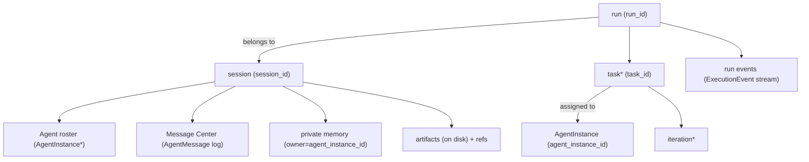

# tauri-agent-next 概念对齐（Glossary + Boundary）
日期：2026-03-10

本文用于对齐 `tauri-agent-next` 的核心概念与边界，作为后续多 Agent / 持久化 / Prompt 投影实现的共同语言。

## 1. 目标与原则

### 1.1 目标
- 支持多 Agent 角色（`planner/coder/reviewer/...`）在同一用户会话内协作
- 支持 private 上下文跨 run 复用（私有记忆/执行痕迹可持续）
- 支持“对话共享、执行私有、产物落盘共享（默认不入 prompt）”

### 1.2 核心原则
- **Shared Conversation**：对话过程以 **Message Center** 为事实源，按路由/订阅对相关 Agent 可见（对话类消息通常广播到 session scope 以保证协作）
- **Private Execution**：某个 Agent 的执行过程与工具结果默认仅自己可见（private）
- **Artifacts**：产物通常以落盘方式共享，默认不注入上下文；只共享“引用/索引”（path/hash/desc 等）

> 这里的 shared/private 是 “对 session 内 Agent 的可见性”，不等价于“是否对用户 UI 可见”。

---

## 2. 概念定义（推荐口径）

### 2.1 `session`（用户对话会话）
一个用户对话线程（thread），跨多次用户请求复用上下文的容器。

- 主键：`session_id`
- 生命周期：用户开始对话 → 多次 run → 用户结束/归档
- 职责：
  - 存储共享对话事实（shared）与可选的私有记忆（private）
  - 存储默认配置（默认 `llm_config/system_prompt/work_path` 等）
  - 持久化 Agent roster（同 session 下有哪些 AgentInstance）

### 2.2 `run`（一次用户请求触发的执行作业）
一次用户请求（HTTP `POST /runs`）触发的一次执行作业（job）。run 以可观测、可取消、可回放为目标。

- 主键：`run_id`
- 生命周期：`run.started` →（多次 LLM/tool/step）→ `run.finished|run.error|stopped`
- 边界：
  - `run` 是控制/观测单位，不等价于 session
  - 同一 session 下可以有多个 run

### 2.3 `task`（模型/编排层的工作项）
编排层拆分出的工作项，可分配给某个 AgentInstance 执行。

推荐特性：
- 主键：`task_id`
- 归属：`session_id` +（可选）`run_id`
- 指派：`assigned_agent_instance_id`
- 依赖：`depends_on_task_ids`（可选）

关系建议：
- 1 run 内可以有 1..N 个 task
- 1 task 由 1 个 AgentInstance 串行执行（见 2.6）

### 2.4 `iteration`（一次 ReAct 循环单元）
模型内部一次 ReAct 回合（你之前称 round），建议统一叫 `iteration`。

语义：
- 1 task 可以包含 0..N 次 iteration
- 每次 iteration 通常是：LLM 推理/产出 tool_call → tool_result → 继续推理/收敛

### 2.5 `step`（观测层最小颗粒）
用于 UI/回放/流式展示的最细粒度事件片段（例如 `answer_delta/tool.started/...`）。

注意：
- step 是观测/流式单位，不建议直接当作 prompt 记忆的事实源（噪声大、体量大）

### 2.6 `AgentInstance`（可持久化的“工人”）
一个 session 内可持久化的 Agent 执行单元（actor/worker）。它有稳定身份，用于跨 run 私有上下文归属。

约束与能力：
- 主键：`agent_instance_id`（即 `AgentInstance.id`，在 session 内唯一）
- 允许：**同一个 profile 可以有多个 AgentInstance**
- 执行模型：**单个 AgentInstance 串行执行 task**
- 并发模型：需要并发且无显式依赖时，创建更多 AgentInstance 以并行处理

> `AgentInstance` 是“逻辑实体”，需要落库以支持反序列化与跨 run 复用；不是 Python 进程内对象的持久化。

### 2.7 `message center`（消息中心）
用于 session 内的 **统一通信与可查询事实源**（inbox/outbox）。

- 所有用户输入、Agent 输出、RPC request/response、广播事件都应通过 Message Center 投递与持久化
- 对某个 AgentInstance 来说：它的 **shared 历史** = Message Center 中“该 Agent 可接收（可路由/订阅命中）”的消息集合
- 这意味着 shared 不一定是“所有 Agent 都看到同一份”；`broadcast` 才是全员可见，`unicast` 仅目标可见

---

## 3. Agent 相关概念

### 3.1 `agent type`（实现类型）
描述 Agent 的实现/能力边界，用于路由与执行方式：
- `assistant`
- `user_proxy`
- `orchestrator`

### 3.2 `agent profile`（协作角色）
描述 Agent 的协作职责与提示词/权限配置：
- `planner`
- `coder`
- `reviewer`

profile 典型包含：
- system prompt 片段（persona/规则/格式）
- 工具可用范围与工具策略
- 预算与压缩策略（token budget / truncation / summarize）
- 产物共享策略（落盘目录、manifest 规则等）

### 3.3 `agent id`
此处约定：`agent id` 指 **AgentInstance 的稳定 id**（即 `agent_instance_id`）。

> 如果运行时还需要“run 内临时实例 id”，建议另起名字（例如 `runtime_agent_id`），避免混淆。

---

## 4. 可见性模型（Shared vs Private）

### 4.1 shared（共享）
对某个 AgentInstance 来说，shared 历史来自 **Message Center**（并且该 Agent 能接收到）。

常见包含：
- 用户输入与需求变更（统一走 Message Center）
- 其它 Agent 的结论、约束、决策、计划变更
- `rpc_request` / `rpc_response`（v1：也进入 shared 历史，只要该 Agent 可接收）
- 产物引用/索引（artifact refs，内容落盘）

### 4.2 private（私有）
只对某个 AgentInstance 可见的记录，默认用于保存执行细节与工具输出：
- `tool_call` / `tool_result`（默认 private）
- 调试信息、执行过程笔记（如需要）
- 该 Agent 的私有滚动摘要（private summary）

private 记录必须带：
- `owner_agent_instance_id`

> 注：shared/private 是 Memory 层的过滤维度，不要求在最终 prompt 中显式标注。

### 4.3 共享对话 vs 共享产物
你们的目标是：
- **对话共享**：共享事实进入 shared
- **产物共享**：产物内容落盘，shared 中只记录引用，不默认注入 prompt

这要求系统提供：
- artifact 的落盘工具能力（写文件/打 patch/产物目录）
- artifact 的索引能力（path/hash/desc/created_by/...）

---

## 5. 事件与存储边界（建议）

### 5.1 run 事件（观测/回放）
用于观测与回放的细粒度事件流（例如 `ExecutionEvent`），建议按 `run_id` 存储，包含：
- run.started / run.finished
- llm/tool 的 chunk 与状态更新

特点：
- 体量大、噪声大
- 不作为 prompt 事实源（最多作为调试引用）

### 5.2 session 事件（上下文事实源）
用于重建上下文与跨 run 复用的事实源，建议存 SQLite（或等价的可查询存储）：
- shared：Message Center 的消息日志（按“当前 Agent 可接收消息”投影进 Memory）
- private：owner agent 的私有记忆/执行记录（例如工具调用过程/中间笔记）

特点：
- 需要可投影（按 viewer 过滤 private）
- 需要可压缩（summary/cursor）；v1 约定 **摘要仅对 private 生效**，避免 private → shared 泄漏

### 5.3 artifacts（落盘共享）
产物内容落盘（work_path 或 runtime data dir），在 DB 中只存引用/索引。

默认策略：
- Prompt 不注入产物内容
- 需要时由 Agent 通过工具读取/检索产物

---

## 6. Prompt 构建视图（按 AgentInstance）

对某个 AgentInstance 构建 prompt 时，建议使用“投影视图”：

1) System
- base system prompt
- agent profile prompt（planner/coder/reviewer）
- agent instance override（可选）

2) History（事实源）
- shared 历史：Message Center 中该 Agent 可接收的消息
- private 历史：仅 owner==当前 agent_instance_id 的私有执行记录
- 产物只注入引用（artifact refs），不注入内容

3) Current input
- 当前 task 的输入（或 run 的用户请求 + 编排层子任务描述）

4) Budget/Compress
- truncation（对长文本、tool 输出等）
- summarize（v1：仅对 private 历史做滚动摘要，按 agent_instance_id 分开维护）
- drop（兜底，保留 system + summary + 最近 N 条）

---

## 7. 并发与调度（建议）

### 7.1 串行约束
- 同一个 `agent_instance_id` 同时只能执行一个 task（队列/锁）

### 7.2 并发扩容
- 当需要并发且任务间无显式依赖：创建更多 AgentInstance（同 profile 多实例）
- 任务分配由 orchestrator 决定

### 7.3 资源冲突（必须提前考虑）
即使 task 无显式依赖，也可能因共享资源冲突（尤其是同一 `work_path` 的写操作）。

建议最小策略：
- 默认“单写者”或对写工具加互斥（work_path 级写锁）
- 允许并发执行读/分析类 task

---

## 8. 关系图（概念）

---

## 9. v1 约定（便于落地）
- tool_result 默认 private（owner=当前执行 AgentInstance）
- shared 事实源统一来自 Message Center（用户输入、Agent 输出、RPC 请求/响应等都走消息中心）
- Memory 构建单 Agent 视图：仅纳入“该 Agent 可接收”的 Message Center 消息
- 摘要/压缩：v1 仅对 private 做滚动摘要；shared 只做预算丢弃/截断兜底
- shared 中必须有“任务/结果/产物引用”的高层记录，否则其它 Agent 无法协作
- artifact 内容默认不进入 prompt；只存引用，按需读取
