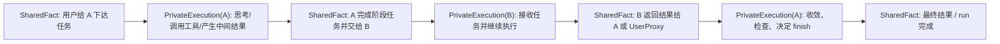
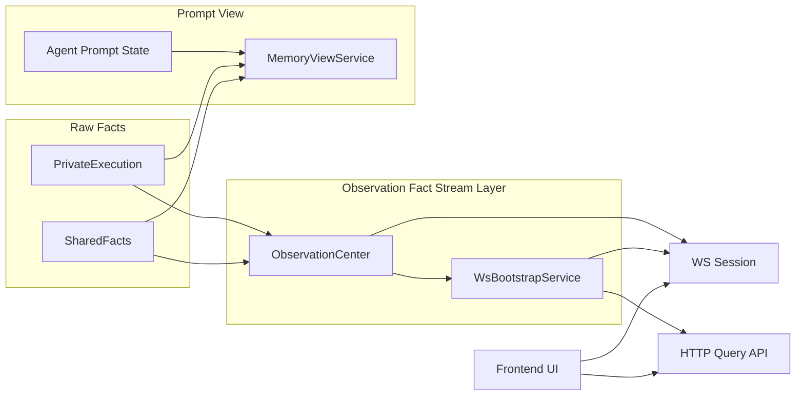
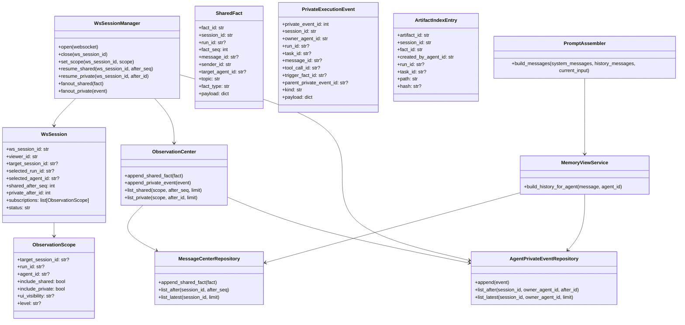
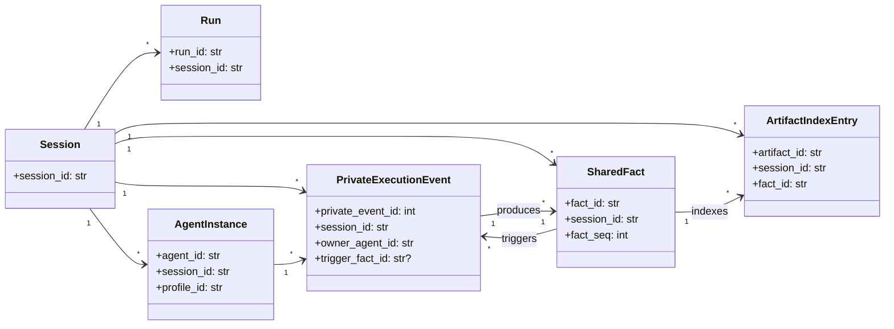
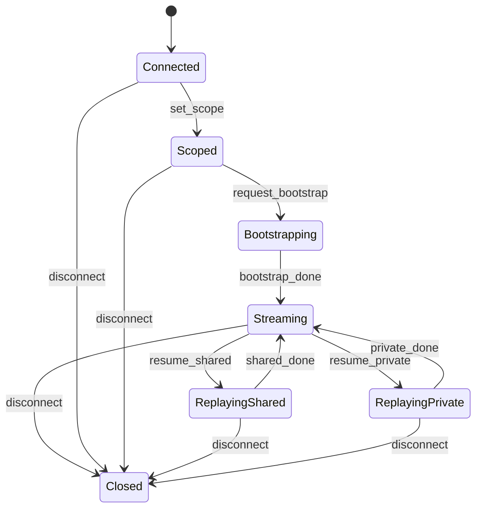
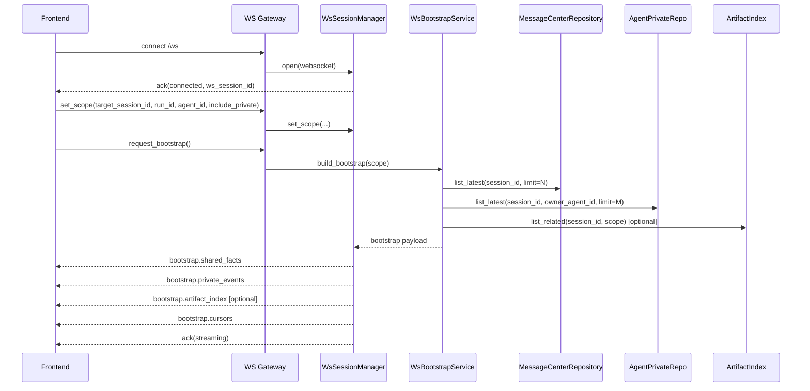
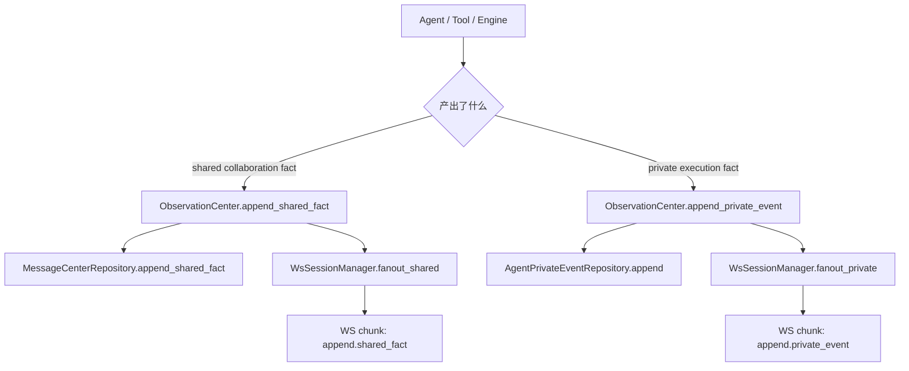
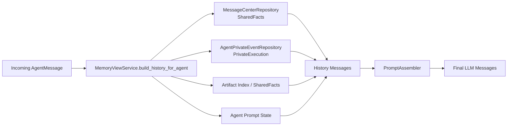

# WS Session / Observation / SharedFacts / PrivateExecution Design

日期：2026-03-13

## 1. 目标

这份文档描述 `tauri-agent-next` 后端在 `WebSocket 会话层`、`Observation`、`shared/private 数据组织` 方面的目标设计。

目标不是重写现有执行链路，而是把下面四件事对齐：

- 前端实时事件通过一个真正的 `WS Session` 模块统一管理
- `SharedFacts` 和 `PrivateExecution` 成为统一事实源
- `AgentMemory` history、HTTP 查询、WS 推流都基于同一套事实语义
- 前端拿到足够的原始事实后，可以自己重建 `global view` 和 `agent full view`

## 2. 核心判断

更合理的定义是：

> `Observation` 不应该是独立于 `SharedFacts` 和 `PrivateExecution` 之外的第三份原始数据，
> 也不应该承担前端展示投影的组装职责。

更准确地说：

> `Observation` 应该被定义为基于 `SharedFacts` 与 `PrivateExecution`
> 的事实流、回放、过滤与补发层。

因此底层原始事实主记录收敛为：

- `SharedFacts`
- `PrivateExecution`

而 `Observation` 负责：

- 接收与写入原始事实
- 维护顺序号与因果引用
- 根据 scope / policy 过滤可见数据
- 提供 bootstrap / resume / append 推流

它不负责：

- 为前端预先组装 `timeline items`
- 生成后端专属 `projection view model`
- 维护一套和事实层平行的 UI 数据模型

## 3. 为什么这样更合理

这样设计有几个直接好处：

1. `AgentMemory` 和前端都依赖同一套事实源，不容易分叉。
2. shared/private 的边界清楚，避免“memory 看不到但 UI 看到了”的语义漂移。
3. 前端展示层可以持续演进，而后端事实模型保持稳定。
4. 因果关系可以显式建模，而不是靠 UI 或代码路径猜。
5. `WS Session` 会成为事实流协调层，而不是另一个临时 socket 包装对象。

## 4. 设计原则

1. 原始事实层只保留两类主记录：`SharedFacts` 和 `PrivateExecution`。
2. `Observation` 是事实流层，不是前端投影层。
3. `memory visibility` 和 `UI visibility` 是两套语义，不能复用一个字段偷懒。
4. `WS connection` 只是传输对象，`WS session` 才是前端观察者的状态对象。
5. `session_id` 是 shared/private 的归属主键，`run_id` 是筛选和回放维度，不应替代 `session_id`。
6. `AgentMemory` 读取的是原始 facts，不直接读取前端 view model。
7. 前端恢复追流时，至少要能分别恢复 shared facts 和 private execution 的游标。
8. `AgentMemory` 这一层只产出历史对话，不负责 `system`、工具定义和当前轮输入的最终拼装。
9. 发给 LLM 的历史内容只保留自然对话文本，不把 `fact_id`、`trigger_fact_id` 直接渲染进 `content`。
10. history 排序以时间因果顺序为准，不按 shared/private 做硬分段。

## 5. 事实图模型

### 5.1 基本思想

如果只说 “Observation = SharedFacts + PrivateExecution 的组合”，方向是对的。

但更准确的表达应该是：

> Observation 面对的是一张由 `SharedFacts` 和 `PrivateExecution`
> 通过因果引用连接起来的执行事实图，
> 它负责把这张图作为可查询、可回放、可推流的原始事实流暴露出去。

它不是简单拼成两个列表，而是存在明确的因果关系：

- 一个 `SharedFact` 会触发某个 Agent 的 `PrivateExecution`
- 一个 `PrivateExecution` 结束后可能再产出新的 `SharedFact`
- 多个 Agent 的 private 链路会通过 shared facts 汇合

### 5.2 因果流转图



### 5.3 关联要求

为了让事实图成立，建议补齐这些引用字段：

- `SharedFact.fact_id`
- `PrivateExecution.private_event_id`
- `PrivateExecution.trigger_fact_id`
- `PrivateExecution.parent_private_event_id`
- `task_id`
- `message_id`
- `tool_call_id`
- `run_id`
- `owner_agent_id`

## 6. 数据平面

### 6.1 SharedFacts

`SharedFacts` 是 Agent 协作的事实源。

它包含：

- 用户输入
- Agent 间 `rpc_request`
- Agent 间 `rpc_response`
- Agent 间 `event`
- 任务交接事实
- 交接时一并共享出去的 `artifact_refs`
- run 控制类高层事实

它不包含：

- tool 原始输出大文本
- LLM delta
- 调试流
- 别的 Agent 未共享出来的中间思考

建议存储：

- `message_center_events`
- 主键维度：`session_id`, `fact_id`
- 顺序游标：`fact_seq`

### 6.2 PrivateExecution

`PrivateExecution` 是某个 AgentInstance 的私有执行记录。

它包含：

- `tool_call`
- `tool_result`
- `reasoning_note`
- `reasoning_summary`
- `private_summary`
- `execution_error`
- 可选的中间决策记录

它不包含：

- 已经共享给其他 Agent 的 handoff 事实
- 已经作为 shared 输出的 artifact handoff

建议存储：

- `agent_private_events`
- 主键维度：`session_id`, `owner_agent_id`, `private_event_id`
- 顺序游标：`private_event_id`

### 6.3 ArtifactRefs

`artifact_ref` 从语义上属于“被共享出去的产物引用”。

因此：

- 它在 handoff 或回复别人时，应作为 `SharedFact.payload` 的一部分发布出去
- 它不是和 `SharedFact`、`PrivateExecution` 并列的第三类主事实
- 如果后续需要快速查 artifact，可以额外维护 `ArtifactIndex`
- `ArtifactIndex` 只是从 shared facts 派生的索引，不是新的事实源
- 是否维护 `ArtifactIndex`，取决于实际 handoff 是否频繁携带 artifact refs，以及前端/AgentMemory 是否需要高频检索

一个共享 handoff 事实的例子：

```json
{
  "fact_type": "handoff",
  "sender_id": "Planner",
  "target_agent_id": "Coder",
  "payload": {
    "text": "我已经拆好了，文档在 docs/ws-session-observation-private-design.md，交给 Coder。",
    "artifact_refs": [
      {
        "artifact_id": "art_001",
        "path": "docs/ws-session-observation-private-design.md",
        "kind": "document"
      }
    ]
  }
}
```

### 6.4 数据关系图



## 7. 前端视图如何重建

### 7.1 总原则

后端只需要把足够的原始事实和增量推流给前端。

前端负责把这些数据组装成：

- global timeline
- agent full view
- task tree
- handoff panel
- artifact panel

也就是说：

> Observation 不负责替前端做展示组装，
> 前端应该自己从原始事实构建显示视图。

### 7.2 Frontend Global View

全局视图可以由前端根据下面的数据自行构建：

- 全局可见 `SharedFacts`
- 可见范围内的 `PrivateExecution` 摘要事件
- 从 shared payload 中提取的 `artifact_refs`
- run / task / handoff 的状态字段

它默认不直接暴露所有 private 明细，具体仍由后端权限控制。

### 7.3 Frontend Agent Full View

单 Agent 完整视图可以由前端根据下面的数据自行构建：

- 该 Agent 可见的 `SharedFacts`
- 该 Agent 自己的 `PrivateExecution`
- 和该 Agent 相关的 `artifact_refs`

所以从产品语义上，这个目标是成立的：

> 前端可以通过 shared facts 和每个 Agent 的 private execution，重建每个 Agent 的完整 view。

## 8. 核心对象 UML



## 9. 存储模型 UML



## 10. 关键字段建议

### 10.1 SharedFact

建议字段：

- `fact_id`
- `session_id`
- `run_id`
- `fact_seq`
- `message_id`
- `fact_type`
- `message_type`
- `rpc_phase`
- `sender_id`
- `target_agent_id`
- `target_profile_id`
- `topic`
- `payload`
- `metadata`
- `created_at`

建议 `payload` 允许包含：

- `text`
- `artifact_refs`
- `task_state`
- `handoff`
- `result_summary`

### 10.2 PrivateExecutionEvent

建议字段：

- `private_event_id`
- `session_id`
- `owner_agent_id`
- `run_id`
- `task_id`
- `message_id`
- `tool_call_id`
- `trigger_fact_id`
- `parent_private_event_id`
- `kind`
- `payload`
- `created_at`

建议 `kind`：

- `tool_call`
- `tool_result`
- `reasoning_note`
- `reasoning_summary`
- `private_summary`
- `execution_error`

说明：

- `agent_private_events` 是 private 事实源
- `AgentPromptState` 只是由 private facts 压缩出来的缓存
- `private_summary` 属于 private，不会自动变成 shared
- 如果某个摘要要交给其他 Agent，看作新的 `SharedFact`

### 10.3 ArtifactIndexEntry

建议字段：

- `artifact_id`
- `session_id`
- `fact_id`
- `created_by_agent_id`
- `run_id`
- `task_id`
- `path`
- `hash`
- `desc`
- `created_at`

说明：

- 这是可选索引，不是主事实表
- 它应当可以完全由 shared facts 重建

### 10.4 WS Bootstrap Payload

建议字段：

- `shared_facts`
- `private_events`
- `artifact_index?`
- `cursors`
- `scope`
- `generated_at`

说明：

- 这是响应模型，不是新的事实表
- 返回的是原始事实块，不是后端投影后的 timeline

## 11. WS Session 目标设计

### 11.1 为什么要单独有 `WsSession`

`WsConnection` 只表示一条 socket 连接，不足以表达：

- 当前前端在看哪个业务 `session`
- 当前前端在看哪个 `run`
- 当前前端在看哪个 `agent`
- 当前前端是否允许查看当前选中 Agent 的 private 记录
- shared facts 恢复游标
- 当前选中 Agent 的 private 恢复游标
- 当前 scope 的订阅状态

因此需要显式引入 `WsSession`。

### 11.2 `WsSession` 状态机



### 11.3 首次连接流程



### 11.4 恢复流程

建议至少分开恢复：

- `resume_shared(after_fact_seq)`
- `resume_private(after_private_event_id)`

不建议保留单一续传游标，因为 shared/private 不是同一个游标空间。

```json
{
  "shared_after_seq": 128,
  "private_after_id": 41
}
```

说明：

- 当前设计默认一次只查看一个 Agent 的 private
- 如果以后需要多 Agent private 调试台，应作为单独的 debug scope 设计，不放进当前主协议

### 11.5 推流事件类型

建议对前端只推原始事实块：

- `append.shared_fact`
- `append.private_event`
- `ack`
- `error`

不单独推：

- `projection.timeline`
- `projection.snapshot`
- `projection.task_view`

## 12. Observation 事实流流程



## 13. AgentMemory History 目标读法

`AgentMemory` 不应该直接读取任何前端 view model。

正确读取顺序应是：

1. 从 `MessageCenterRepository` 读取相关 shared facts
2. 从 `AgentPrivateEventRepository` 读取当前 `owner_agent_id` 的 private facts
3. 从 shared facts 或 `ArtifactIndex` 读取相关 artifact refs
4. 从 `AgentPromptState` 读取 private summary cache
5. 按时间因果顺序组装为 history messages

这里的关键边界是：

- `AgentMemory` 只负责产出历史对话
- `system` 在外层
- 当前轮输入在外层
- 最终 LLM 请求由外层 `PromptAssembler` 负责

也就是：

- 这一层输出：`history_messages`
- 外层输出：`final_messages = system + history_messages + current_input`



### 13.1 History 渲染规则

发给 LLM 的历史消息统一采用标准 `role/content` 结构。

#### 原始用户请求

原始用户请求保留为：

```json
{
  "role": "user",
  "content": "..."
}
```

#### SharedFacts

共享事实渲染为：

```json
{
  "role": "assistant",
  "content": "[UserProxy] 用户要求重新设计 WS Session、Observation、SharedFacts、PrivateExecution 的数据模型，并希望前端能重建每个 Agent 的完整视图。交给 Planner 执行。"
}
```

或：

```json
{
  "role": "assistant",
  "content": "[Planner] 我已经拆好了，文档在 docs/ws-session-observation-private-design.md，交给 Coder。"
}
```

规则：

- 只渲染自然语言内容
- 只保留 `[Speaker]`
- 不把 `fact_id`、`trigger_fact_id` 塞进文本
- `artifact_ref` 如果已共享，应体现在自然语言 handoff 中

#### PrivateExecution

当前 Agent 自己的 private execution 渲染为：

```json
{
  "role": "assistant",
  "content": "[Planner] 我判断 Observation 不应该是第三份原始数据，而应该是 SharedFacts 和 PrivateExecution 的事实流层。"
}
```

或：

```json
{
  "role": "assistant",
  "content": "[Coder] 我先看看 Planner 交付的任务和设计文档。"
}
```

规则：

- 只渲染当前 Agent 自己的 private
- 不渲染别的 Agent 的 private
- 不插入“以下是共享事实”或“以下是你的私有执行记录”这种说明句

#### Private Summary

`summary` 属于 private，进入 history 时仍按 private message 处理，例如：

```json
{
  "role": "assistant",
  "content": "[Coder] 我已经确认当前仓库里 shared 走 message_center_events，private 还在 conversation_events，下一步要拆 agent_private_events。"
}
```

规则：

- summary 不单独占据 shared 语义
- summary 是否进入 history，由当前 Agent 的 prompt budget 决定
- `AgentPromptState` 中的 summary 是缓存，不是新的事实源
- 如果摘要需要让别的 Agent 看见，必须重新发布为 `SharedFact`

### 13.2 组装顺序

历史消息按时间因果顺序组装，而不是按 shared/private 硬分段。

规则：

1. 最先是原始用户请求
2. 之后所有 history 按真实发生顺序排列
3. 当前 Agent 只能看到自己 private 和他人 shared
4. 下游 Agent 不能看到上游 Agent 的 private

### 13.3 Planner 视角示例

下面这个示例表示 Planner 在完成拆解并发出 handoff 前后看到的 history。

```json
[
  {
    "role": "user",
    "content": "重新设计 WS Session、Observation、SharedFacts、PrivateExecution 的数据模型，并希望前端能重建每个 Agent 的完整视图。"
  },
  {
    "role": "assistant",
    "content": "[UserProxy] 用户要求重新设计 WS Session、Observation、SharedFacts、PrivateExecution 的数据模型，并希望前端能重建每个 Agent 的完整视图。交给 Planner 执行。"
  },
  {
    "role": "assistant",
    "content": "[Planner] 我判断 Observation 不应该是第三份原始数据，而应该是 SharedFacts 和 PrivateExecution 的事实流层。"
  },
  {
    "role": "assistant",
    "content": "[Planner] 我准备把任务拆成三部分：定义 SharedFact、定义 PrivateExecutionEvent、设计 WS Session 的 bootstrap 和 resume。"
  },
  {
    "role": "assistant",
    "content": "[Planner] 我已经拆好了，文档在 docs/ws-session-observation-private-design.md，交给 Coder。"
  }
]
```

说明：

- 前两条是 user + shared
- 中间两条是 Planner private
- 最后一条是 Planner 发布出去的 shared handoff

### 13.4 Coder 视角示例

下面这个示例表示 Coder 在收到 Planner handoff 后看到的 history。

```json
[
  {
    "role": "user",
    "content": "重新设计 WS Session、Observation、SharedFacts、PrivateExecution 的数据模型，并希望前端能重建每个 Agent 的完整视图。"
  },
  {
    "role": "assistant",
    "content": "[UserProxy] 用户要求重新设计 WS Session、Observation、SharedFacts、PrivateExecution 的数据模型，并希望前端能重建每个 Agent 的完整视图。交给 Planner 执行。"
  },
  {
    "role": "assistant",
    "content": "[Planner] 我已经拆好了，文档在 docs/ws-session-observation-private-design.md，交给 Coder。"
  },
  {
    "role": "assistant",
    "content": "[Coder] 让我先看看任务。"
  },
  {
    "role": "assistant",
    "content": "[Coder] 我需要先实现 agent_private_events，再调整 AgentMemory 的读取路径。"
  }
]
```

### 13.5 按这个格式需要修正的设计点

按上面的 history 设计，文档里需要明确遵守：

1. `AgentMemory` 输出的是 history messages，不是最终 prompt。
2. `system` 不属于这层，由外层装配。
3. `SharedFact` 和 `PrivateExecution` 的 id 只存在于存储层和引用层，不直接进入 LLM 文本。
4. history 按时间因果顺序排列，而不是按 shared/private 分块。
5. 下游 Agent 只能看到上游共享出来的内容，不能看到上游 private。
6. `summary` 属于 private，不属于 shared。

## 14. 模块边界建议

### 14.1 `transport/ws/session.py`

负责：

- `WsSession` 数据结构
- session 级 cursor
- session 级 scope
- session 级状态机

不负责：

- facts 存储读写
- private event 查询实现
- 前端视图投影

### 14.2 `transport/ws/session_manager.py`

负责：

- open / close
- scope mutation
- bootstrap
- resume
- fanout

### 14.3 `observation/center.py`

负责：

- 接收 shared/private 原始事实
- 调用 repository 持久化
- 做顺序号、过滤和推流
- 按 scope 列出 shared/private 事实
- 作为 shared/private 写入的统一入口

不负责：

- 生成 timeline projection
- 生成 snapshot view model
- 替前端拼装显示结构

### 14.4 `services/ws_bootstrap_service.py`

负责：

- 首屏 shared facts
- 首屏 private events
- 可选的 artifact index
- cursor 初始化

### 14.5 `repositories/agent_private_event_repository.py`

负责：

- private event append
- 按 `session_id + owner_agent_id` 查询
- 按 `run_id` 辅助过滤
- 按 `tool_call_id` 辅助查询

### 14.6 Frontend Assembler

负责：

- 从 `shared_facts + private_events + artifact_refs` 组装 timeline
- 组装 agent panel / handoff panel / task panel
- 本地维护 UI 级别的派生状态

## 15. 推荐演进顺序

### Phase A

- 显式定义 `SharedFact` 的统一口径
- 给 shared/private 都补齐 `session_id`
- 给 private 增加 `trigger_fact_id`
- 明确 `artifact_ref` 通过 shared handoff 发布

### Phase B

- 新建 `agent_private_events` 表和 repository
- 把现有 `conversation_events` 中的 private 部分迁移到新表
- `AgentMemory` 改读新表
- `private_summary` 以 `agent_private_events` 为事实源，以 `AgentPromptState` 为压缩缓存

### Phase C

- 新建 `WsSession` 和 `WsSessionManager`
- bootstrap 返回 `shared/private/cursors`
- 如果启用 artifact 索引，再额外返回 `artifact_index`
- resume 分成 `shared/private` 两套 cursor

### Phase D

- 再考虑 viewer policy、调试权限和更细的前端观察模式
- 如果前端确实需要，可在前端本地增加 projection cache

## 16. 最小可落地版本

如果先只补最需要的版本，建议先做到下面这些：

1. 显式引入 `SharedFact` 的统一口径。
2. 新建 `agent_private_events`。
3. `ToolRecorder` 写入 `agent_private_events`。
4. handoff 时把 `artifact_refs` 一并写进 shared fact。
5. `AgentMemory` 改为从 `agent_private_events` 读 private。
6. `WsSession` 支持：
   - `target_session_id`
   - `selected_run_id`
   - `selected_agent_id`
   - `shared_after_seq`
   - `private_after_id`
7. WS 首屏 bootstrap 返回：
   - `shared_facts`
   - `private_events`
   - `artifact_index`（可选）
   - `cursors`

## 17. 结论

后续设计以这个前提为准：

> `Observation` 不是第三份原始数据，也不是后端前端视图投影层。

更准确的说法是：

> `Observation` 是围绕 `SharedFacts` 与 `PrivateExecution`
> 建立起来的事实流、过滤、回放与补发层。

这样前端既能：

- 看全局 shared 流转
- 看单 Agent 的 private 过程
- 重建某个 Agent 的完整视图

同时又不会让 `AgentMemory`、HTTP 查询、WS 推流各自维护一套不同的“事实定义”。
